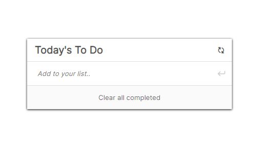
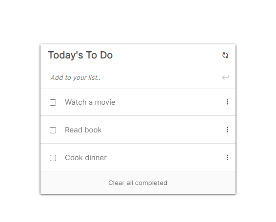
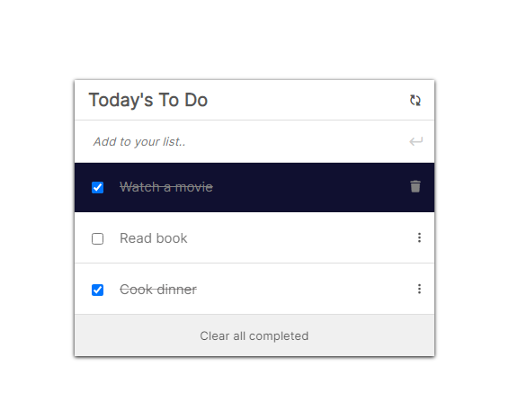

# To-Do-List

This app is designed to offer the same functionalities as an actual **To-Do-List** application where user can create a task, change description of a task, change status of a task, and delete a task. In addition, the app preserves user data into the browser storage, allowing user to reaccess their data even after they've reloaded the browser.


## Built With

- html
- css
- JavaScript
- Webpack


## Live Demo

For live version, pleave visit [To-Do-Link](https://sntakirutimana72.github.io/To-Do-list/)


## Screenshots

<table>
  <tr>
    <td>First Screen Page</td>
    <td>With Tasks</td>
    <td>With Selected Tasks</td>
  </tr>
  <tr>
    <td></td>
    <td></td>
    <td></td>
  </tr>
 </table>


## Getting Started

To get a copy of this project running on your local computer, do the followings:

### Prerequisites

- Must have a working computer
- A Web-Browser installed (Chrome - Recommended)

### Setup

- Install _VSCode_ ([link](https://code.visualstudio.com/download))
- Clone this project repository on your local computer. ([link](../../))
- Open the project directory with _VSCode_

### Install

Open _Terminal/Shell_ inside your _VSCode_ and run
  ```
    npm install --force
  ```

### Run tests

- For _**webhint**_ tests, run
  ```
    npm run lint:hint
  ```
- For _**stylelint**_ tests, run
  ```
    npm run lint:style
  ```
- For _**eslint**_ tests, run
  ```
    npm run lint:es
  ```
- To run a _**local server**_, run
  ```
    npm start
  ```
- For testing _**functionalities**_, run
  ```
    npm test
  ```


## Authors

👤 **Steve**

- GitHub: [@sntakirutimana72](../../../)

## 🤝 Contributing

Contributions, issues, and feature requests are welcome!

Feel free to check the [issues page](../../issues/).

## Show your support

Give a ⭐️ if you like this project!

## Acknowledgments

- Fellow Micronauts

## 📝 License

This project is MIT licensed.
